# Data generation

## Generator codes

All generators are integrated via the `generative_models` key in `config/simulation.toml`.

### svvamp-based generators

| Code | Generator |
|---|---|
| EUCLID | [Euclidean Box](https://francois-durand.github.io/svvamp/reference/preferences/generator_profile_euclidean_box.html) |
| EUCLID\_1D | Euclidean Box (1D) |
| EUCLID\_2D | Euclidean Box (2D) |
| EUCLID\_3D | Euclidean Box (3D) |
| EUCLID\_5D | Euclidean Box (5D) |
| GAUSS | [Gaussian Well](https://francois-durand.github.io/svvamp/reference/preferences/generator_profile_gaussian_well.html) |
| IANC | [Impartial, Anonymous & Neutral Culture](https://francois-durand.github.io/svvamp/reference/preferences/generator_profile_ianc.html) — ⚠️ known issues |
| IC | [Impartial Culture](https://francois-durand.github.io/svvamp/reference/preferences/generator_profile_ic.html) |
| LADDER | [Ladder](https://francois-durand.github.io/svvamp/reference/preferences/generator_profile_ladder.html) |
| PERTURB | [Perturbed Culture](https://francois-durand.github.io/svvamp/reference/preferences/generator_profile_perturbed_culture.html) |
| SPHEROID | [Spheroid](https://francois-durand.github.io/svvamp/reference/preferences/generator_profile_spheroid.html) |
| UFR | [Uniform Few Rankings](https://francois-durand.github.io/svvamp/reference/preferences/generator_profile_uniform_few_rankings.html) |
| UNANIMOUS | [Unanimous](https://francois-durand.github.io/svvamp/reference/preferences/generator_profile_unanimous.html) |
| UNI | [Cubic Uniform](https://francois-durand.github.io/svvamp/reference/preferences/generator_profile_cubic_uniform.html) |
| VMF\_HC | [Von Mises-Fisher Hypercircle](https://francois-durand.github.io/svvamp/reference/preferences/generator_profile_vmf_hypercircle.html) |
| VMF\_HS | [Von Mises-Fisher Hypersphere](https://francois-durand.github.io/svvamp/reference/preferences/generator_profile_vmf_hypersphere.html) |

### R-based generators (Dirichlet Diffusion Dynamics)

These generators require R with the `MASS` and `randcorr` packages. They produce utility matrices using Beta-marginal Dirichlet diffusion on an opinion simplex.

| Code | Description |
|---|---|
| DDD\_BETA\_0-05 | Beta marginals with α, β ∈ (0, 0.05] |
| DDD\_BETA\_0-5 | Beta marginals with α, β ∈ (0, 0.5] |
| DDD\_BETA\_1 | Beta marginals with α, β ∈ (0, 1.0] |
| DDD\_BETA\_2 | Beta marginals with α, β ∈ (0, 2.0] |
| DDD\_BETA\_5 | Beta marginals with α, β ∈ (0, 5.0] |
| DDD\_BETA\_POLAR | Polarised Beta (α = β ∈ (0, 0.5]) |

::: vote_simulation.models.data_generation.generator_registry

## Euclidean box 

| 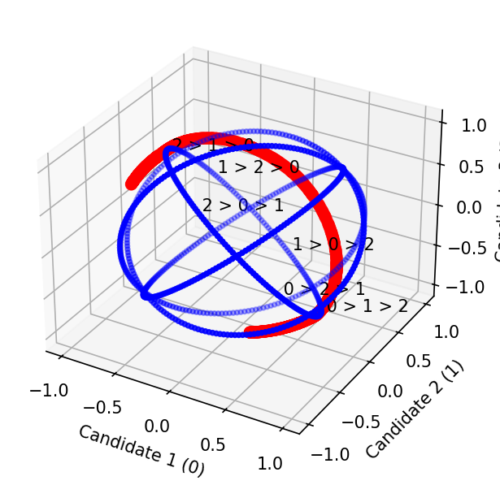 | 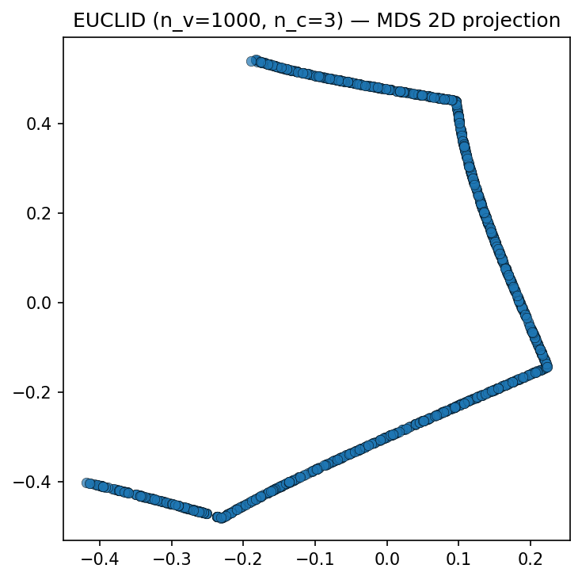 |
|||

## Gauss 

| 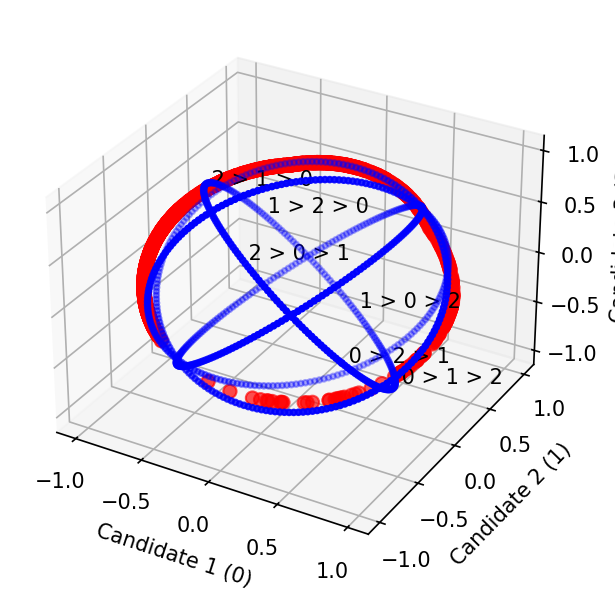 | 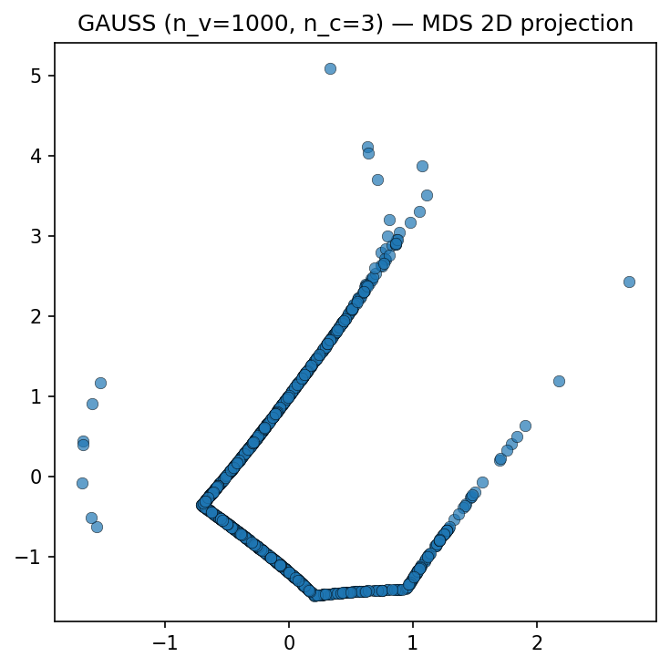 |
|||

## IANC 

Issue to fix not working for now

## IC 

|  | 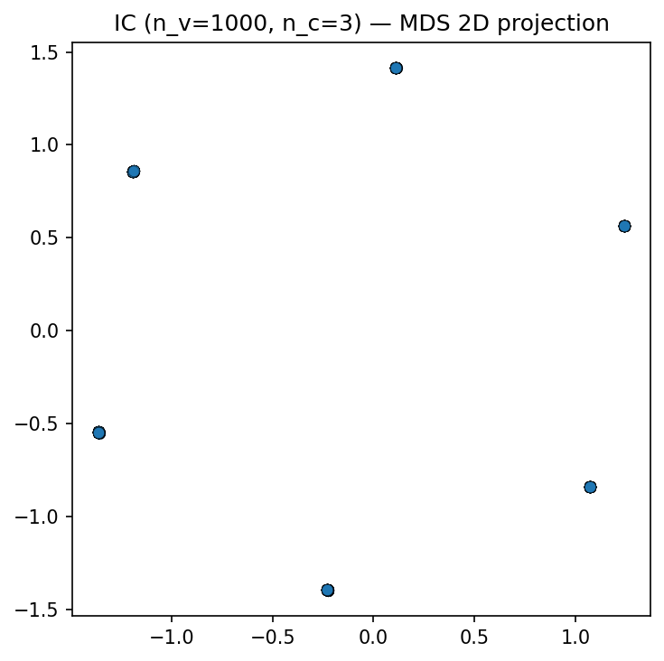 |
|||

## Ladder 

| 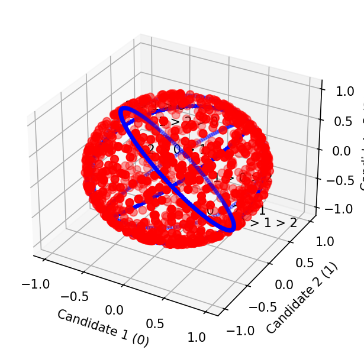 | 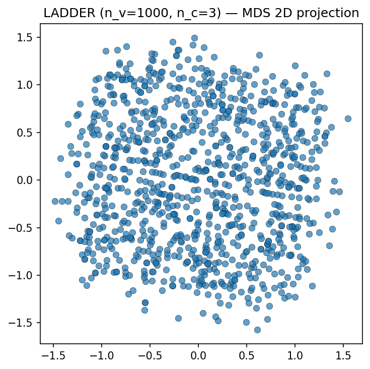 |
|||

## Perturb

| 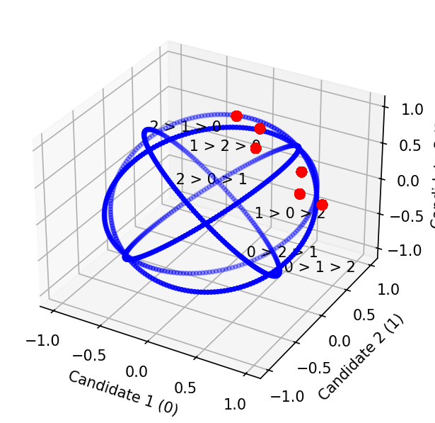 | 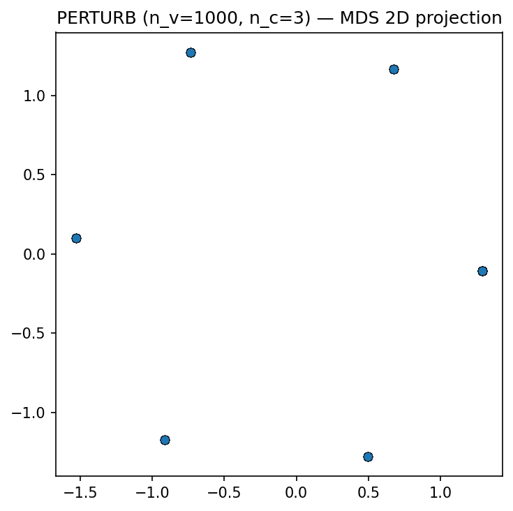 |
|||

## Spheroid 

| 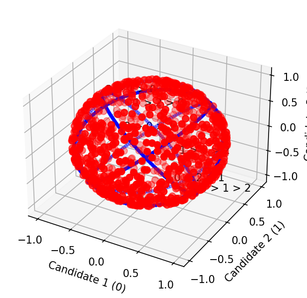 | 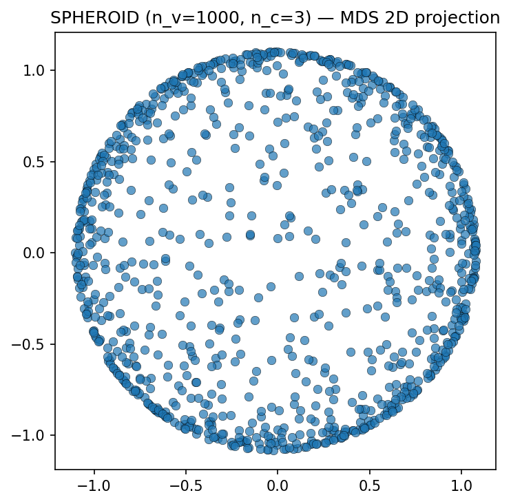 |
|||

## Uniform few ranking 

| 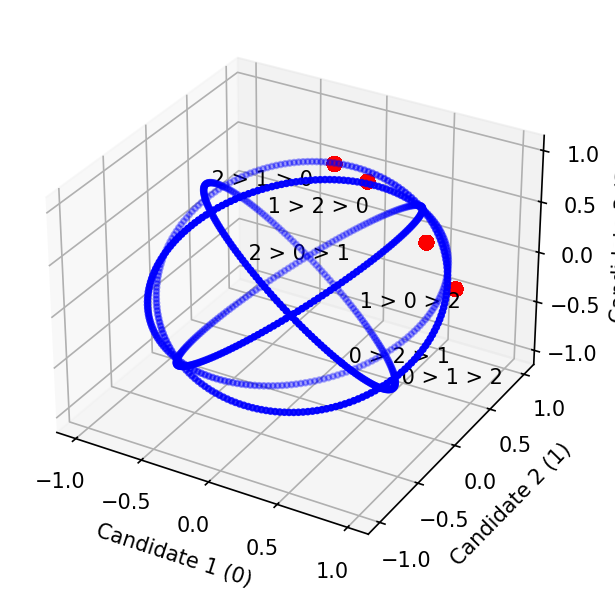 | 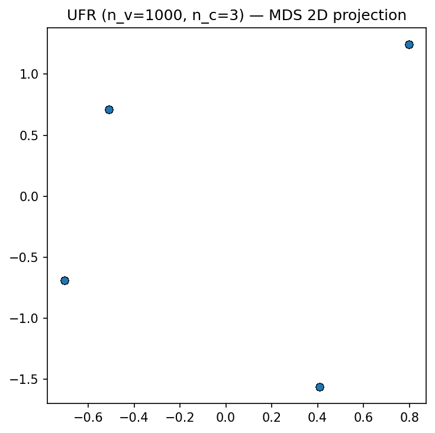 | 
|||

## Unanimous 

| 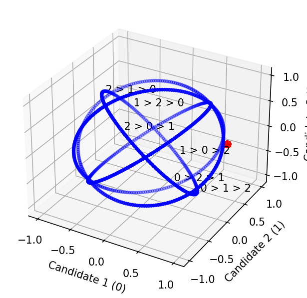 | 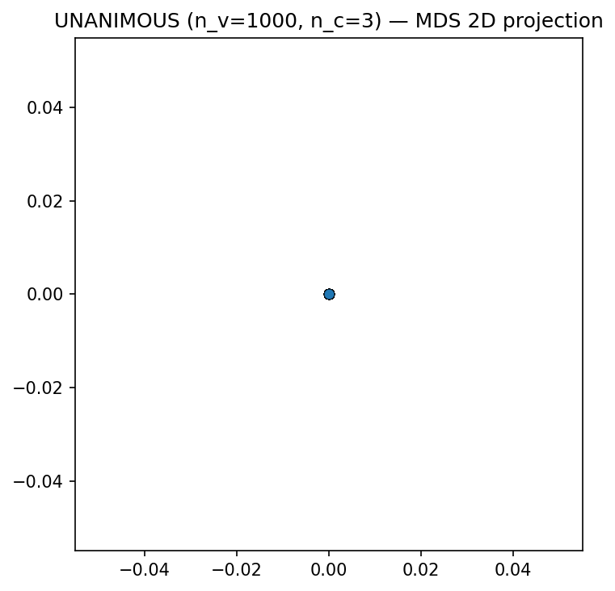 |
|||

## Uniform 

| 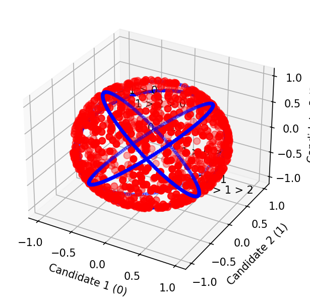 | 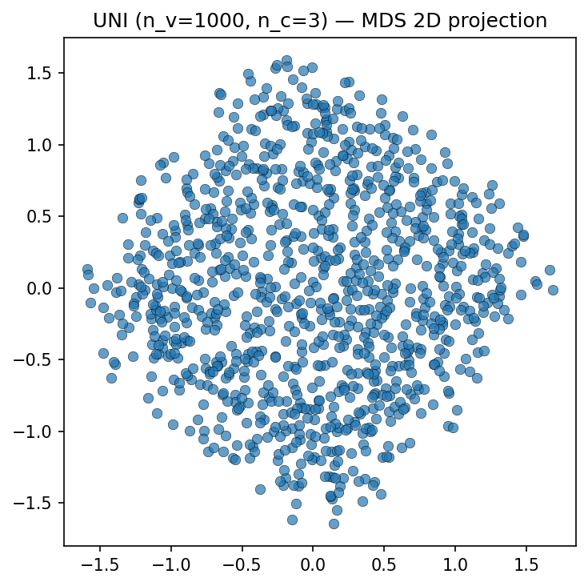 |
|||

## Von Mises-Fisher Hypercircle

| 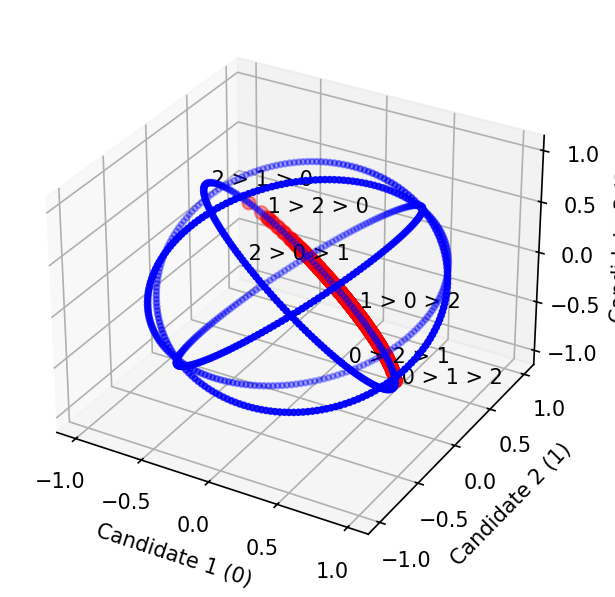 | 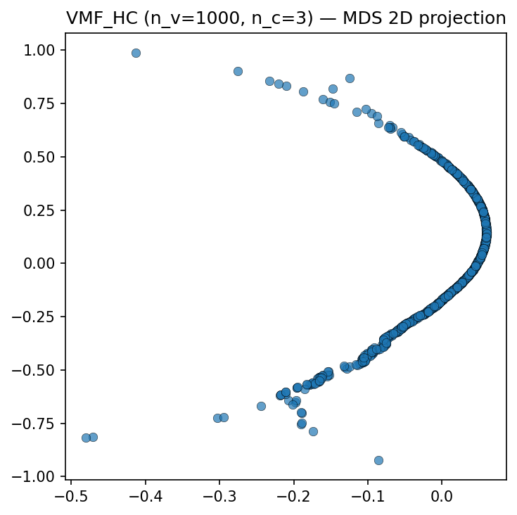 |
|||

## Von Mises-Fisher Hypersphere

| 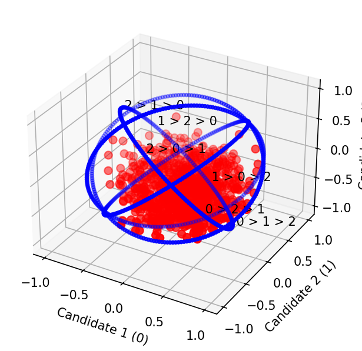 | 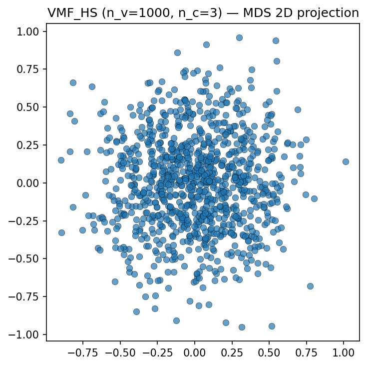 |
|||

